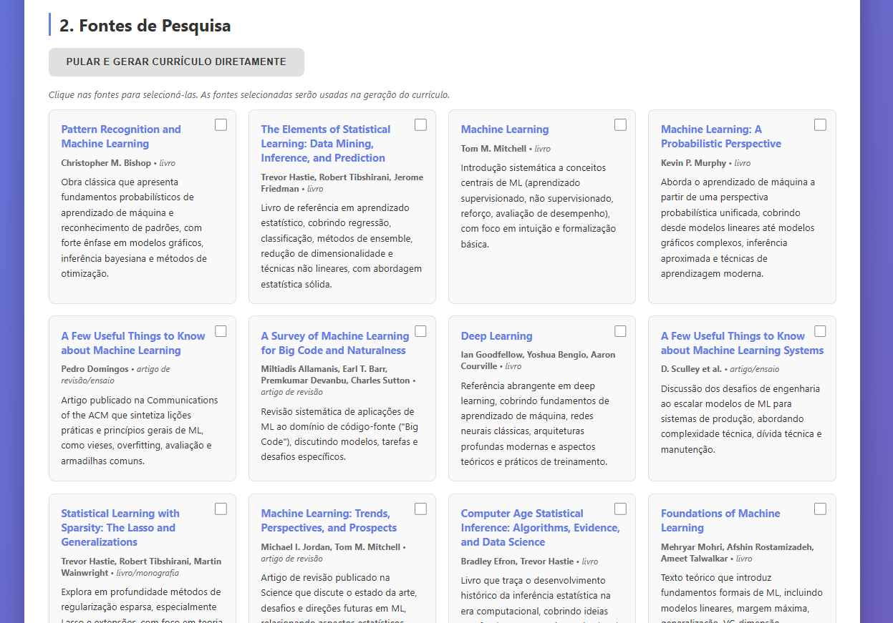
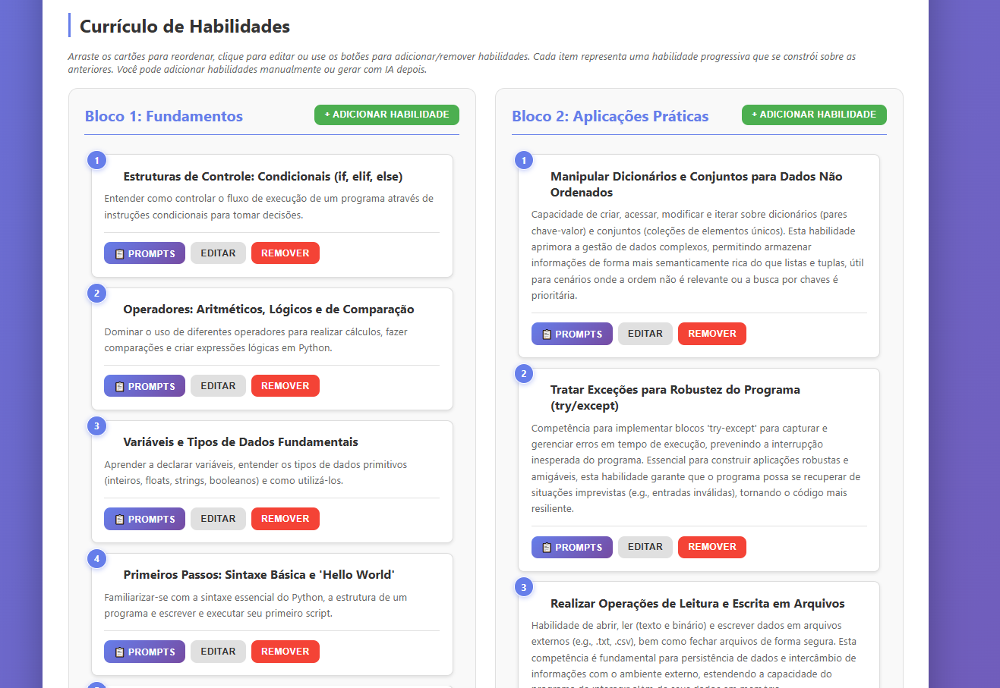
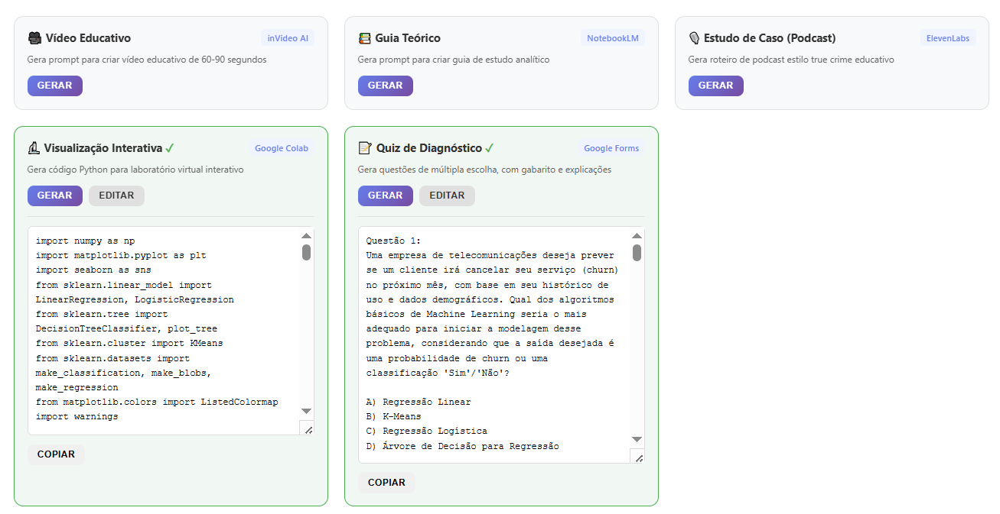
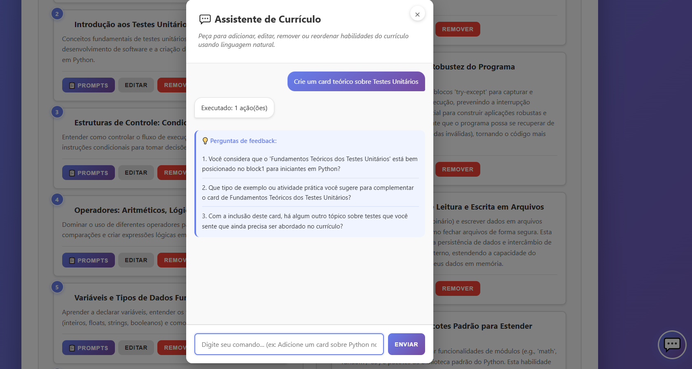
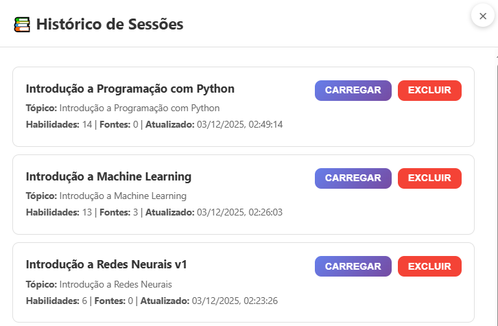

# 🎓 Curriculum Curator Toolkit

> AI-powered curriculum planning assistant for educators. Research topics, generate structured learning paths, and create prompts for educational tools—all in one place.

[](https://www.python.org/)
[](https://fastapi.tiangolo.com/)
[](https://ai.google.dev/)

---

## ✨ Features

| Feature | Description |
|---------|-------------|
| **AI Research** | Enter a topic and get a curated list of research sources (books, articles, essays) |
| **Curriculum Generation** | Auto-generate skill-based subtopics organized in two logical blocks |
| **Interactive Editor** | Drag-and-drop reordering, inline editing, add/remove topics |
| **Chatbot Assistant** | Manage curriculum via natural language: add, edit, remove, or reorder skills |
| **Prompt Export** | Generate ready-to-use prompts for 5 educational tools |
| **Session Persistence** | Save and load curricula in browser LocalStorage |

### Generated Prompts Support

- **inVideo AI** — Video scripts (60–90 sec)
- **NotebookLM** — Analytical study guides
- **ElevenLabs** — Podcast scripts (true crime style)
- **Google Colab** — Python visualization code
- **Google Forms** — Multiple-choice quiz with answer key

---

## 🎬 Demo

<video src="static/demo_chatbot.mp4" controls width="640" poster="static/feature_chatbot.png"></video>

*Chatbot assistant in action — manage curriculum with natural language commands.*

---

## 📸 Screenshots

| Research | Curriculum Blocks |
|----------|-------------------|
|  |  |

| Tool Prompts | Chatbot | Session History |
|--------------|---------|-----------------|
|  |  |  |

---

## 🛠 Tech Stack

- **Backend:** FastAPI (Python)
- **Frontend:** Vanilla HTML, CSS, JavaScript
- **AI:** Google Gemini API (Gemini 2.5 Flash)
- **Server:** Uvicorn

---

## 🚀 Quick Start

### 1. Clone & install

```bash
git clone https://github.com/luizMlo/curriculum-curator-toolkit.git
cd toolkit-professor-curador
pip install -r requirements.txt
```

### 2. Configure API key

Create a `.env` file:

```env
GEMINI_API_KEY=your_gemini_api_key_here
```

Get your key at [Google AI Studio](https://aistudio.google.com).

### 3. Run

```bash
python run.py
```

Open **http://localhost:8000** in your browser.

---

## 📁 Project Structure

```
toolkit-professor-curador/
├── app.py              # FastAPI backend (REST API + AI)
├── run.py              # Dev server with auto-reload
├── requirements.txt   # Python dependencies
├── .env.example       # Environment template
├── .gitignore
├── README.md
└── static/
    ├── index.html     # Main UI
    ├── styles.css     # Styles
    ├── script.js      # Frontend logic
    ├── demo_chatbot.mp4
    └── feature_*.png  # Screenshots
```

---

## 📡 API Endpoints

| Method | Endpoint | Description |
|--------|----------|-------------|
| GET | `/` | Serves main HTML page |
| POST | `/api/research` | Research topic and find sources |
| POST | `/api/generate-curriculum` | Generate curriculum with AI |
| POST | `/api/generate-method-card-prompt` | Generate prompt for a tool |
| POST | `/api/chatbot` | Process natural language commands |

---

## ⚙️ Requirements

- Python 3.8+
- [Google Gemini API key](https://aistudio.google.com)
- Internet connection (for Gemini API calls)

---

## 📝 Notes

- **Security:** Store your API key in `.env` (never commit it)
- **Storage:** Data is saved only in browser LocalStorage (no server DB)
- **Privacy:** All data stays local except Gemini API requests

---

## 🐛 Troubleshooting

| Issue | Solution |
|-------|----------|
| "Erro ao pesquisar tópico" | Check `GEMINI_API_KEY` in `.env` |
| Port in use | Change port in `run.py` or use `uvicorn app:app --port 8001` |
| Module not found | Run `pip install -r requirements.txt` |

---

## 📄 License

Open source — free for educational use.

---

# 🎓 Kit do Professor Curador (PT-BR)

Assistente de planejamento curricular com IA para educadores. Pesquise tópicos, gere currículos estruturados e crie prompts para ferramentas educacionais.

## Funcionalidades

- **Pesquisa com IA:** Digite um tópico e obtenha fontes de pesquisa curadas
- **Geração de currículo:** Subtópicos organizados em dois blocos (Fundamentos e Aplicações)
- **Editor interativo:** Arrastar e soltar, editar, adicionar e remover habilidades
- **Assistente de chat:** Gerencie o currículo em linguagem natural
- **Prompts para ferramentas:** inVideo, NotebookLM, ElevenLabs, Colab, Google Forms
- **Persistência:** Salve e carregue sessões no navegador

## Uso rápido

```bash
pip install -r requirements.txt
# Crie .env com GEMINI_API_KEY=sua_chave
python run.py
# Abra http://localhost:8000
```
